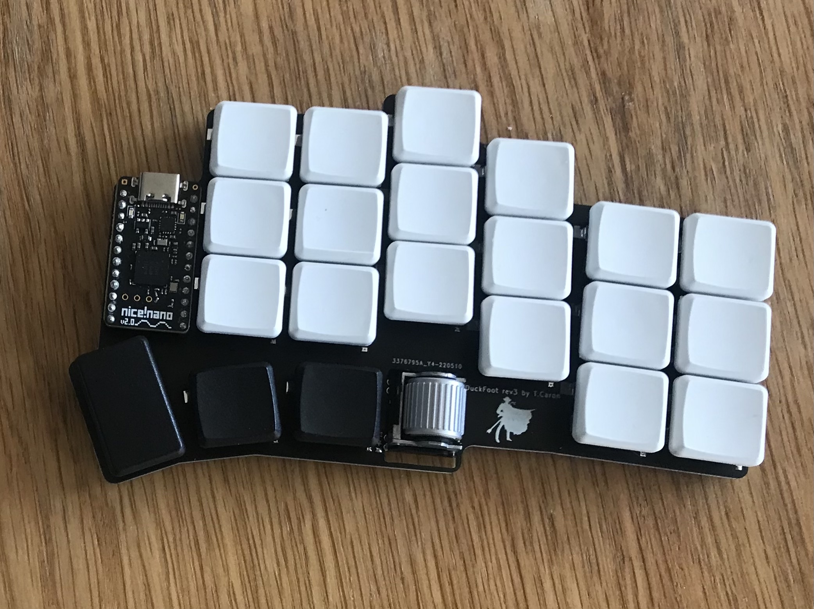
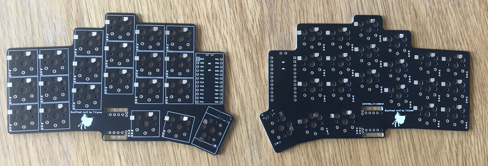
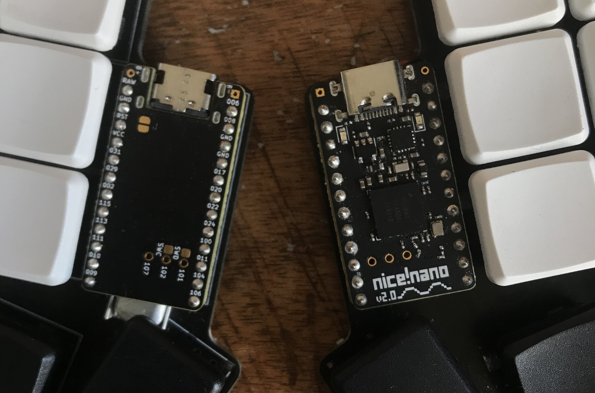

# DuckFoot-rev3

Duckfoot is a low profile Corne-inspired split keyboard, powered with Nice!Nano. With a pair of EVQWGD001 roller encoders.

## PCB

Kicab files made with ergogen.

Switches footprint is Kailh Choc V1, supporting [hotswap socket](https://splitkb.com/collections/keyboard-parts/products/kailh-hotswap-sockets?variant=39472161456205) or direct soldering (I wouldnt do that if I were you).

You'll also need:
- MSK12C02 on/off switch
- [Reset micro tactil switch](https://www.aliexpress.com/item/32873382894.html)
- a bunch off smd diodes
- 90mAh batteries. You can chose bigger capacity, but honestly with no LEDs on the board, you won't need more. I chose direct soldering for batteries because JST sockets are to big and a nightmare to wire.

The board is reversible, so one minimal order on PCBWay or JLCPCB gives you 2.5 keyboard and a seconde chance if you suck at soldering.

Reversible means left Nice!Nano has to be soldered upside down. If you're lost, pins are idendified on the printed silk layer of the pcb (at least RAW, GND, RST, VCC).

## Plate and case

Soon.

## Config

### Net matrix
Querty example

|      | P2 | P3 | P4 | P7 | P8 | P10 |   
|------|----|----|----|----|----|-----|
| P1   | tab | Q | W | E | R | T |
| P20  | Shift | A | S | D | F | G |
| P19  | Ctrl | Z | X | C | V | B |
| P9   |     |   |  rollclik  | thumb  | thumb |  thumb  |

### ZMK Config example

## Licence

DWTFYWT Public Licence.
